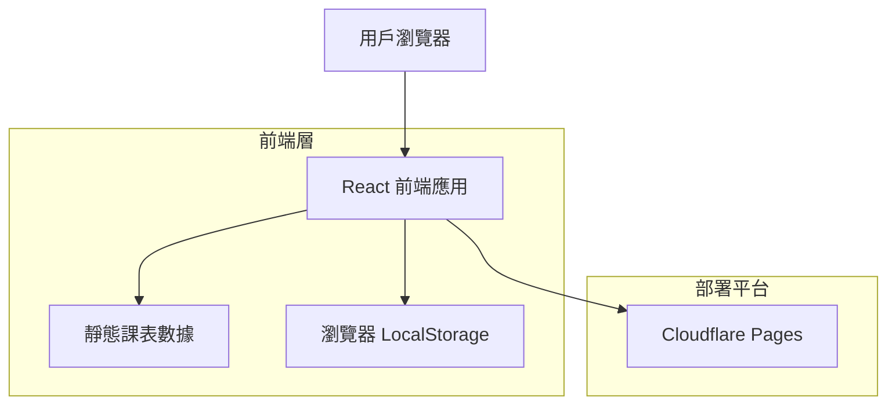
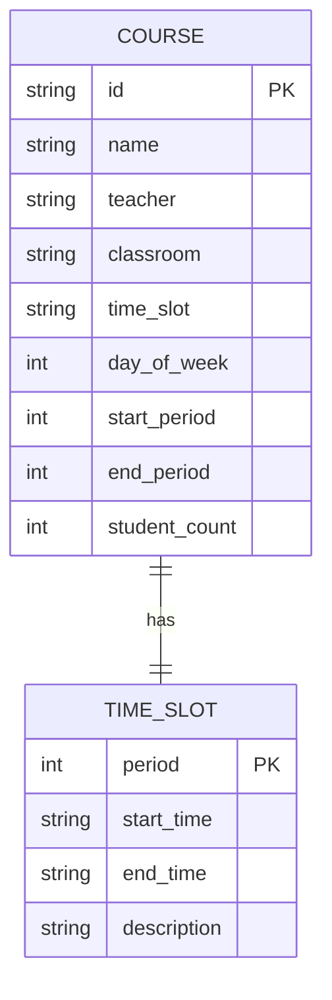

# 課表網頁技術架構文檔

## 1. Architecture design



## 2. Technology Description

- Frontend: React@18 + tailwindcss@3 + vite
- Backend: None（純靜態網頁）
- 部署平台: Cloudflare Pages

## 3. Route definitions

| Route | Purpose |
|-------|---------|
| / | 主頁面，顯示課表和時間導航 |

## 4. Data model

### 4.1 Data model definition



### 4.2 Data Definition Language

由於是靜態網頁，課表數據將以 JSON 格式存儲在前端：

```javascript
// 課程數據結構
const courseData = {
  // 作息時間表
  timeSlots: [
    { period: "1-2", startTime: "8:15", endTime: "9:45" },
    { period: "3-4", startTime: "10:05", endTime: "11:35" },
    { period: "5-6", startTime: "13:00", endTime: "14:30" },
    { period: "7-8", startTime: "14:50", endTime: "16:20" },
    { period: "9", startTime: "16:30", endTime: "17:15" },
    { period: "10-11", startTime: "18:15", endTime: "19:45" },
    { period: "12", startTime: "19:55", endTime: "20:40" }
  ],
  
  // 課程安排
  courses: [
    {
      id: "course_1",
      name: "國際關係理論與實務",
      teacher: "蔡楊",
      classroom: "A8-202",
      dayOfWeek: 1, // 星期一
      timePeriod: "1-2",
      studentCount: null
    },
    {
      id: "course_2",
      name: "西方政治制度史",
      teacher: "",
      classroom: "主-217A",
      dayOfWeek: 2, // 星期二
      timePeriod: "1-15",
      periods: "3-4",
      studentCount: 29,
      courseCode: "政治23361"
    },
    {
      id: "course_3",
      name: "中國社會政治分析",
      teacher: "",
      classroom: "主-501A",
      dayOfWeek: 3, // 星期三
      timePeriod: "1-15",
      periods: "3-4",
      studentCount: 20,
      courseCode: "政治學23361"
    },
    {
      id: "course_4",
      name: "行政法學",
      teacher: "",
      classroom: "主-1150",
      dayOfWeek: 4, // 星期四
      timePeriod: "1-15",
      periods: "3-4",
      studentCount: 32,
      courseCode: "政治學24361"
    },
    {
      id: "course_5",
      name: "國家安全教育",
      teacher: "",
      classroom: "B4-102",
      dayOfWeek: 5, // 星期五
      timePeriod: "1-15",
      periods: "1-2",
      note: "體育法25041 法律25031（人權）法律25023（民商）法律25022（民商）法律25021（民商）法律25011（基礎）"
    },
    {
      id: "course_6",
      name: "地緣政治學",
      teacher: "周天楓",
      classroom: "20B-3",
      dayOfWeek: 5, // 星期五
      timePeriod: "5-6"
    },
    {
      id: "course_7",
      name: "國家安全教育",
      teacher: "",
      classroom: "B4-102",
      dayOfWeek: 2, // 星期二
      timePeriod: "10-11",
      note: "行政管理25382（行政管理）政管25381（行政管理）紀委片25491（網絡新媒體）紀委片25481（攝影攝像）紀委片25471（紀錄片）"
    }
  ],
  
  // 特殊說明
  notes: [
    "周二第6-9節全校不上課"
  ]
};
```

## 5. 核心功能實現

### 5.1 時間自動定位功能
```javascript
// 獲取當前學期週次
function getCurrentWeek() {
  const now = new Date();
  const semesterStart = new Date('2025-09-16'); // 學期開始日期
  const diffTime = Math.abs(now - semesterStart);
  const diffDays = Math.ceil(diffTime / (1000 * 60 * 60 * 24));
  return Math.ceil(diffDays / 7);
}

// 高亮當天課程
function highlightTodayCourses() {
  const today = new Date().getDay(); // 0=Sunday, 1=Monday, ...
  // 實現高亮邏輯
}
```

### 5.2 響應式佈局
使用 Tailwind CSS 實現響應式設計：
- 移動端：垂直堆疊課程卡片
- 桌面端：傳統表格佈局
- 支持觸摸滑動切換星期