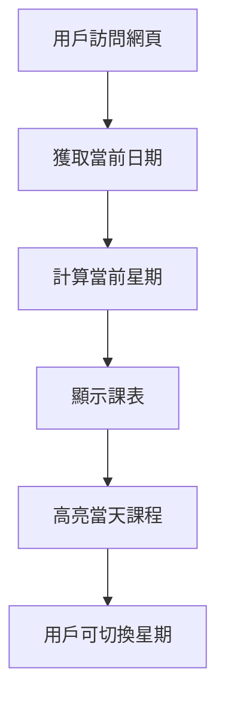

# 課表網頁產品需求文檔

## 1. Product Overview
一個智能課表顯示網頁，專為上海政法學院政府管理學院學生設計，能夠根據用戶瀏覽器時間自動定位到當前星期並顯示相應的課程安排。
- 解決學生查看課表不便的問題，提供清晰直觀的課程時間表顯示
- 目標是為學生提供便捷的課表查詢工具，提升學習效率

## 2. Core Features

### 2.1 Feature Module
我們的課表網頁需求包含以下主要頁面：
1. **主頁面**：課表顯示區域、時間導航、課程詳情展示

### 2.2 Page Details

| Page Name | Module Name | Feature description |
|-----------|-------------|---------------------|
| 主頁面 | 課表顯示區域 | 顯示完整的週課表，包含星期一到星期五的課程安排，按時間段劃分（第1-2節到第12節） |
| 主頁面 | 時間導航 | 自動檢測當前日期並高亮顯示當前星期，提供週次切換功能 |
| 主頁面 | 課程詳情 | 顯示課程名稱、教室位置、教師姓名、上課時間、學分等詳細信息 |
| 主頁面 | 作息時間表 | 顯示各節課的具體時間安排（如第1-2節：8:15-9:45） |

## 3. Core Process

用戶訪問網頁後，系統自動獲取當前日期，計算並定位到當前學期的對應星期，高亮顯示當天的課程。用戶可以通過導航切換查看其他星期的課表。

## 4. User Interface Design

### 4.1 Design Style
- 主色調：藍色系（#2563eb）和綠色系（#16a34a），輔助色為灰色（#6b7280）
- 按鈕樣式：圓角按鈕，現代扁平化設計
- 字體：系統默認字體，標題16-18px，正文14px
- 佈局風格：表格式佈局，頂部導航，卡片式課程顯示
- 圖標風格：簡潔的線性圖標

### 4.2 Page Design Overview

| Page Name | Module Name | UI Elements |
|-----------|-------------|-------------|
| 主頁面 | 課表顯示區域 | 表格佈局，白色背景，邊框分隔，課程卡片使用不同顏色區分，響應式設計適配手機和桌面 |
| 主頁面 | 時間導航 | 頂部固定導航欄，包含星期選擇器和當前日期顯示，藍色主題 |
| 主頁面 | 課程詳情 | 彈出式詳情卡片或側邊欄，包含完整課程信息 |
| 主頁面 | 作息時間表 | 左側固定時間軸，清晰標註各節課時間 |

### 4.3 Responsiveness
採用移動優先的響應式設計，在手機端優化觸摸交互，桌面端提供更豐富的信息展示。支持橫屏和豎屏模式。